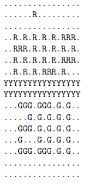

# Problem: Mosaics  
Building mosaics is an art dedicated to the construction of images by assembling small pieces of somematerial.  Lego pieces are all about building things by assembling small pieces, and therefore theypresent the flexibility and versatility to create wonderful mosaics.  
&emsp;You have been commissioned to build a large lego mosaic.  The basic idea is to use a lego plateand on the top of it attach some lego bricks.  Each lego stud is like a pixel in the image.  If we usedtext to represent a mosaic, with ‘.’  representing a stud without a brick, ‘R’ for a red brick, ‘Y’ for ayellow brick and ‘G’ for a green brick, then the mosaic of the image below would be represented by:  
 
   
  
&emsp;For the construction of the mosaic you have available a verylarge set of1×Nbricks.  In particular, for the purposes of themosaic, you can assume you have an infinite number of 9 differ-ent types of bricks (in any needed color).  These are1×1,1×2,1×3,1×4,1×6,1×8,1×10,1×12and1×16bricks,  and aredepicted in the figure on the right.  
&emsp;For  aesthetic  reasons,  you  only  want  to  use  the  bricks  inthe horizontal positions, that is, parallel to the bottom of theplate. This means that when seen from the top, as in the textualrepresentation above, the width of the bricks is variable, but theheight is always1.  
&emsp;When  you  were  starting  the  construction,  you  noticed  that  even  with  those  constraints,  therewere several different ways of building the mosaic.  For example, the mosaic below has 16 differentways of using pieces to obtain the exact same image (with ‘B’ meaning a blue brick):  
  
For a general case, can you tell in how many different ways you could build the desired mosaic?  

## Task   
Given the description of a lego mosaic, your task is to compute in how many different ways you canbuild  that  mosaic  assuming  you  have  an  infinite  pool of1×1,1×2,1×3,1×4,1×6,1×8,1×10,1×12and1×16lego bricks, in any color.  The bricks must be positioned in horizontal positions.  

## Input  
The first line of input contains two integers R and C, indicating respectively the number of rows andcolumns of the mosaic to be built.  
&emsp;The next R lines of input contain each exactly C characters detailing the mosaic to be built.  Each character must either be ‘.’  (representing a stud without any brick on top of it) or a capital letter(from ‘A’ to ‘Z’) representing a stud of a given color.  Two bricks with the same letter representing ithave the same color.  You can assume that there is at least one brick in the mosaic.  

## Output  
The output should consist of a single integerWindicating the number of ways in which the mosaiccan  be  built,  given  that  you  can  only  use  bricks  of  type 1×1,1×2,1×3,1×4,1×6,1×8,1×10,1×12and1×16 on horizontal positions.  You can assume you always have enough bricks to build themosaic using any combination of the bricks you need.  
## Constraints 
- 1≤R, C≤1 000 &emsp;Number of rows and columns of the mosaic  
- 1≤W <263  &emsp;&emsp;&nbsp;&nbsp;Number of different ways to build the mosaic  
## Input example 1  
4 4  
....  
YYBB  
YBBB  
....  
## Output example 1  
16  
##  Input example 2  
3 6  
GGRRRR  
GYYRRR  
GGRRRR  
## Output example 2  
20482

